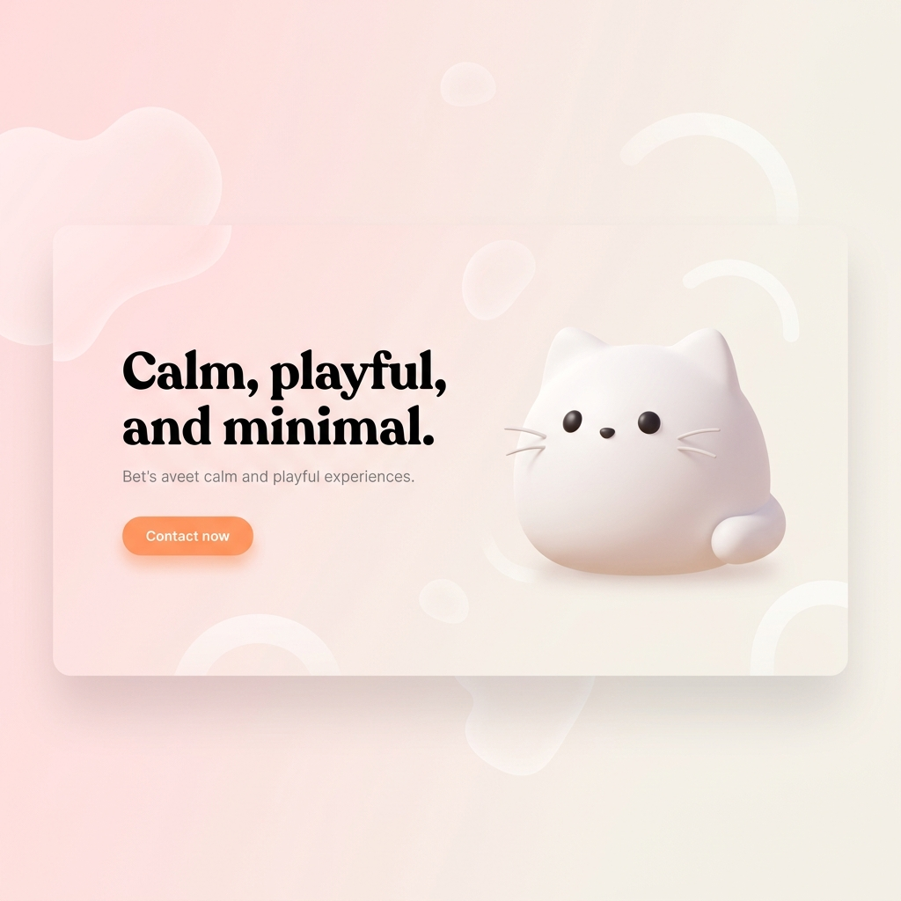

# NyaNudge 🐾
> **Your cat-powered wellness companion.**

NyaNudge is a delightful mobile health companion that transforms daily habits into moments of joy. Using a crew of animated cat characters, NyaNudge sends gentle, witty reminders for hydration, meals, exercise, and more.

## ✨ Features

- **Animated Cat Characters**: Meet the crew! **Mochi** (the surprised one), **Kuro** (the mischievous one), and **Sora** (the calm one). Mochi and Kuro featuring interactive React-based SVGs with mouse-tracking and random behaviors.
- **SQLite Persistence**: Full CRUD operations using `@capacitor-community/sqlite`. Supports mobile (native) and web (WASM/sql.js) environments.
- **Smart Reminders**: 5 default health categories (Water, Meal, Exercise, Bathroom, Meds) with intelligently calculated fixed and interval schedules.
- **Localization Infrastructure**: Built-in support for multiple languages (English & Portuguese BR fully implemented) with automatic date and time formatting (AM/PM vs 24h).
- **Privacy First**: Local-only processing. No data ever leaves your device.
- **Streak Tracking**: Maintain consistency and impress your cat crew with multi-day streaks and completion history with a visual activity heatmap.

## 🛠 Tech Stack

- **Framework**: [React 19](https://react.dev/) + [Vite 8](https://vite.dev/)
- **Native Bridge**: [Capacitor 8](https://capacitorjs.com/)
- **State**: [Zustand](https://docs.pmnd.rs/zustand/getting-started/introduction) (Persistent middleware for database synchronization)
- **Database**: [SQLite](https://sqlite.org/) via `@capacitor-community/sqlite`. Custom service layer for mapping snake_case SQL to camelCase TypeScript.
- **Animations**: [Lottie-web](https://github.com/airbnb/lottie-web) & Interactive React SVGs
- **Styling**: Vanilla CSS with Design Tokens & CSS Modules
- **i18n**: [i18next](https://www.i18next.com/) with region-aware formatting.

## 🚀 Getting Started

### Prerequisites
- Node.js (v20+)
- npm or pnpm
- Java JDK 17 or higher
- Android SDK (v34+)

### Installation
```bash
# Install dependencies
npm install

# Run development server
npm run dev
```

### Component Documentation (Storybook)
We use Storybook to develop and document our shared component library and animation registry.
```bash
# Start Storybook
npm run storybook
```
### Build (Android)

To generate an Android APK, ensure you have the Android SDK properly configured.

1.  **Configure Android SDK**:
    Create or edit `android/local.properties` and add the path to your Android SDK:
    ```properties
    sdk.dir=/path/to/your/android/sdk
    ```
    *(On macOS with Homebrew, this is typically `/opt/homebrew/share/android-commandlinetools`)*.

2.  **Build the Web Application**:
    ```bash
    npm run build
    ```

3.  **Sync with Capacitor**:
    ```bash
    npx cap sync
    ```

4.  **Generate the APK**:
    Navigate to the `android` directory and run the Gradle wrapper:
    ```bash
    cd android
    ./gradlew assembleDebug
    ```
    The generated APK will be located at: `android/app/build/outputs/apk/debug/app-debug.apk`.

## 📂 Project Structure

```text
src/
├── core/           # Database Manager, sql services, i18n
├── features/       # Feature-specific modules (Home, History, Settings, Reminders)
├── shared/         # Common UI library, Animation registry, and global utilities
└── assets/         # SVGs, Lottie JSONs, and sound files
```

## 🐱 Animation & Character System
Characters like Mochi and Kuro use a combination of random event loops (blinking, ear twitching) and mouse-tracking eye movement. 

### Future Animation Direction 🚀
We are currently moving towards decoupling the specific cat characters from the task-based animations (water, food, medicine). The goal is to show **only the task category animation** (the object) so that these can be dynamically paired with whichever cat character the user has selected.

---
Built with ❤️ and many 🐾 by the NyaNudge team.
